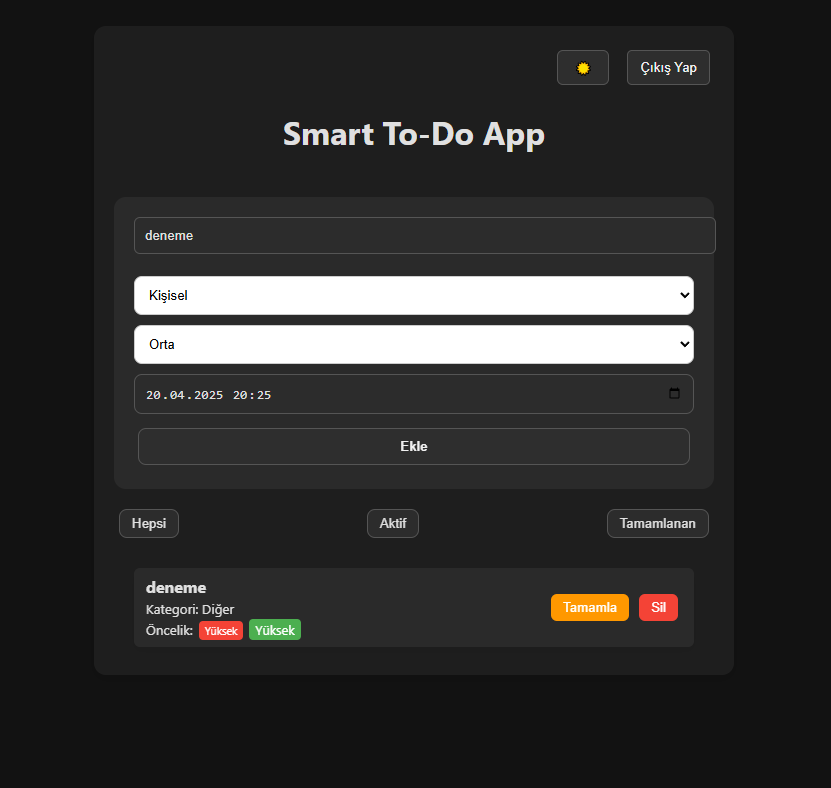

v1.0.0

# Smart To-Do App 📝

Bu uygulama, React ve Firebase kullanılarak geliştirilmiş bir görev takip sistemidir. Kullanıcılar giriş yaparak kendi görevlerini ekleyebilir, filtreleyebilir, tamamlayabilir ve silebilir.

## 🚀 Özellikler
- Firebase Authentication ile giriş/kayıt
- Görev CRUD işlemleri (ekle, sil, tamamla)
- Dark Mode
- Filtreleme (Hepsi / Aktif / Tamamlanan)
- Öncelik, kategori ve deadline alanları
- Animasyonlu geçişler ve kullanıcı dostu arayüz

## 🛠️ Kullanılan Teknolojiler
- React
- Firebase (Auth + Firestore)
- CSS

## 📸 Görseller


## 🔗 Canlı Demo
https://smart-to-do-app-to.netlify.app

## 📁 Kurulum
```bash
git clone https://github.com/taaozdemir/smart-todo.git
npm install
npm start
